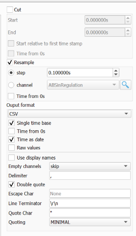

# Aide fonctionnelle SEED

[Retour à l'application](index.html)

Guide de l'outil de normalisation des mesures bancs, destiné aux exploitants d'essais familiers du traitement du signal.

L'application fonctionne dans le navigateur, sans serveur. Les fichiers sont traités en mémoire et aucune donnée ne quitte le poste. La lecture en flux permet de charger des enregistrements volumineux sans décoder tout le fichier simultanément.

## Sommaire

- [Chargement](#1-chargement-dun-fichier-de-mesure)
- [Correction](#2-correction--offset-et-mise-à-léchelle)
- [Pinces](#3-fusion-des-calibres-de-pinces-ampèremétriques)
- [Synchronisation](#4-sources-externes-et-synchronisation)
- [Opérations](#5-opérations-sur-les-voies)
- [Visualisation](#6-visualisation)
- [Plage temporelle](#7-sélection-dune-plage-temporelle)
- [Export SEED](#8-export-seed)
- [Remise à zéro](#9-remise-à-zéro)

## 1. Chargement d'un fichier de mesure

Dans la carte **Fichier**, un seul fichier de mesure est actif à la fois. En charger un nouveau réinitialise la session.

| Bouton | Format attendu | Encodage | Base de temps |
| --- | --- | --- | --- |
| `.M00x` | Morphée, tabulation, 4 lignes d'entête | Sélectionnable | Timer de l'enregistrement libre et horodatage reconstruit depuis Date/Heure |
| BRBC3 | CSV virgule | UTF-8 | Colonne `TEMPS` (s), instant initial lu dans `Time` |
| Soufflerie | CSV point-virgule, 1 ligne d'entête, décimales avec virgule | Windows-1252 | Colonne 1 (s), date/heure dans les colonnes 3 et 2 de la première ligne de données |
| `.seed` | TSV, 1 ligne d'entête | Windows-1252 | Colonne `TEMPS` (s) |

### Entêtes et voies

Le format `.M00x` est positionnel : ligne 1 `MNTPFILE`, ligne 3 noms de voies, ligne 4 unités. Pour BRBC3, l'outil recherche la ligne commençant par `TEMPS` dans les 30 premières lignes et mémorise aussi les constantes d'entête.

Les colonnes entièrement non numériques sont écartées. Les champs vides, `NaN` et booléens deviennent des valeurs absentes : ils restent des discontinuités dans le tracé et ne sont pas interpolés silencieusement.

Les noms de voies connus sont normalisés selon la table de correspondances commune. La correspondance accepte les espaces ou les soulignés ; les voies non référencées gardent leur nom. Pour BRBC3, espaces et `~` deviennent des soulignés, et les constantes d'entête (inertie et coefficients F0/F1/F2) sont ajoutées comme voies constantes.

### Base de temps et encodage

BRBC3, Soufflerie et SEED utilisent un pas estimé depuis les premières mesures, puis reconstruisent une base de temps uniforme. Cela supprime la gigue d'acquisition et fournit un pas constant. Pour `.M00x`, l'horodatage est reconstruit depuis le timer, ce qui préserve les ruptures éventuelles de cadence. Le sélecteur d'encodage ne concerne que les fichiers `.M00x`.

## 2. Correction : offset et mise à l'échelle

La section **Correction** est masquée pour les fichiers `.seed`, déjà normalisés. Une voie est éligible si son nom suit la convention `TYPE_<désignation>_<coefficient>`.

| Préfixe | Grandeur | Unité |
| --- | --- | --- |
| I | Courant | A |
| U | Tension | V |
| T | Température | °C |
| P | Pression | bar |
| D | Déplacement | mm |

Le fichier d'offset doit provenir du même banc. Pour chaque voie éligible, l'offset est la moyenne des 60 dernières secondes du fichier, supposées correspondre à un palier stabilisé au repos.

```text
valeur_corrigée = (valeur_brute - offset) × coefficient / 10 × signe
```

L'offset n'est pas soustrait aux voies de type `T`, car une température absolue n'a pas de zéro instrumental à compenser. La correction repart toujours des valeurs brutes et n'est jamais cumulative. **Réinitialiser** restaure les valeurs d'origine.

## 3. Fusion des calibres de pinces ampèremétriques

La fusion est disponible après la mise à l'échelle. Une famille regroupe les voies ayant la même racine `I_<désignation>` avec des calibres différents en suffixe.

Seules les voies dont l'écart-type dépasse **0,25 A** sont retenues, ce qui écarte les pinces inactives ou bloquées à zéro. Les calibres sont triés par ordre croissant : la pince la plus sensible est conservée aux faibles amplitudes, puis les valeurs de la pince de calibre supérieur la remplacent au-delà de `calibre_précédent - 10`.

La voie résultante porte le suffixe *(fusion des calibres)*.

## 4. Sources externes et synchronisation

La section de synchronisation apparaît lorsqu'un fichier de mesure est chargé.

| Bouton | Extension / séparateur | Entête | Temps |
| --- | --- | --- | --- |
| CSV CAN | `.csv`, virgule ou point-virgule détecté automatiquement | 1 ligne | Secondes ou horodatage pour l'offset ; alignement par index |
| CarScanner | `.csv`, virgule | 1 ligne | `HH:mm:ss.SSS`, passage de minuit géré |
| OBD Facile | `.txt`, point-virgule | 3 lignes, noms ligne 1 et unités ligne 3 | Secondes, notation française |
| Diagra | `.csv`, point-virgule | 3 lignes, noms ligne 2 et unités ligne 3 | Millisecondes |

### Export CSV CAN depuis ASAM MDF

Dans l'outil **ASAM MDF (asammdf)**, exporter le journal CAN avec les réglages ci-dessous. Utiliser les mêmes réglages pour le fichier de mesure et le fichier d'offset.

- **Cut** : décoché, pour exporter l'enregistrement complet.
- **Resample** : coché ; sélectionner **step** pour un fichier à 10 Hz et régler le pas à `0.100000s` (0,1 s, soit 10 Hz). Laisser **Time from 0s** décoché.
- **Output format** : `CSV`.
- **Single time base** et **Time as date** : cochés. Laisser **Time from 0s**, **Raw values** et **Use display names** décochés.
- **Empty channels** : `skip` ; **Delimiter** : virgule (`,`).
- **Double quote** : coché ; **Escape Char** : `None` ; **Line Terminator** : `\r\n` ; **Quote Char** : `"` ; **Quoting** : `MINIMAL`.

Le CSV attendu contient une seule ligne d'entête avec les noms de voies, puis les mesures, avec le temps en première colonne. Conserver les noms d'origine, notamment `TYPE_<désignation>_<coefficient>`, pour permettre la détection des voies éligibles et leur correspondance avec le fichier d'offset.



### Rééchantillonnage

Le pas médian de la source est comparé à celui de la mesure. Si l'écart relatif dépasse `10⁻³`, les voies sont rééchantillonnées par interpolation linéaire sur une grille au pas cible. En deçà, elles restent inchangées pour éviter un lissage inutile.

L'interpolation ne crée aucune valeur en dehors de la plage source ni à cheval sur un trou. Elle agit comme un filtre passe-bas implicite : une source sous-échantillonnée, par exemple CAN à 1 Hz face à un banc à 10 Hz, ne restitue pas la dynamique manquante.

### Mise à l'échelle et alignement

```text
valeur_CAN = (valeur_brute - offset) × coefficient / 10
```

Pour le CAN, le bouton unique **Appliquer offset et échelle CAN** demande un CSV d'offset du même format, puis calcule automatiquement la moyenne des 60 dernières secondes de chaque voie correspondante et la soustrait avant la mise à l'échelle. Les températures (`T`) ne sont pas corrigées en offset. Les voies sans correspondance utilisent un offset nul et sont signalées dans le compte rendu.

Pour les autres sources, le bouton **Mettre à l'échelle** applique seulement `valeur_brute × coefficient / 10`. Le bouton est désactivé si aucune voie n'est éligible et après application, pour éviter un double facteur. Les voies déjà synchronisées sont également mises à jour.

Pour **Synchroniser**, choisir une voie dans chaque source et un seuil. L'outil repère le premier franchissement croissant du seuil (`v[i-1] < seuil` et `v[i] ≥ seuil`), puis aligne les deux indices. Seule la plage commune est conservée et les voies externes sont ajoutées au jeu de mesures.

Choisir un front net, par exemple le démarrage du véhicule sur une voie de vitesse. Un seuil trop bas peut déclencher sur le bruit de zéro. La synchronisation est réversible : une nouvelle synchronisation repart des données non tronquées.

## 5. Opérations sur les voies

| Action | Effet |
| --- | --- |
| Inverser le signe | Multiplie par -1 les voies sélectionnées ; le signe est conservé lors d'une correction. |
| Renommer la voie | Modifie le nom affiché et exporté. Une seule voie à la fois. |
| Supprimer la voie | Retire la voie du jeu de données. |
| Calculer la moyenne (`_moy`) | Calcule la moyenne échantillon par échantillon. |
| Calculer la somme (`_sum`) | Calcule la somme échantillon par échantillon. |
| Correction unitaire | Sur une seule voie sélectionnée, ouvre la saisie d'un offset et d'un gain, puis crée une voie supplémentaire suffixée `_mod` selon `(valeur - offset) × gain`. Les valeurs absentes restent absentes et la voie d'origine n'est pas modifiée. Les valeurs par défaut sont offset `0` et gain `1` ; relancer l'outil sur la même voie met à jour sa voie `_mod`. |
| Créer PHASE_ESSAI | Disponible après chargement d'un fichier Soufflerie. Utilise uniquement `VITESSE_CYCLE`, qui doit être présente. Le retour de consigne à zéro démarre une phase supplémentaire ; la reprise de la consigne démarre la suivante. La détection reprend les règles SEED de fusion des phases courtes et de numérotation. |

Les calculs ignorent les valeurs absentes : la moyenne porte sur les seules voies valides à chaque instant et vaut « absent » si aucune voie ne l'est. L'unité n'est propagée que si toutes les voies sources partagent la même. Relancer un calcul avec les mêmes sources met à jour la voie existante.

Pour `PHASE_ESSAI`, les consignes `VITESSE_CYCLE` dont la valeur absolue est inférieure ou égale à `0,05 km/h` sont neutralisées avant la détection des transitions. Cela évite que le bruit autour de zéro crée de nouvelles phases. Le retour à zéro reçoit un numéro de phase et la reprise de consigne le numéro suivant. Une phase de moins de `200 × fréquence d'échantillonnage` est fusionnée avec la suivante si celle-ci contient une consigne nulle. Les phases actives sont numérotées, avec incrément du numéro après les phases d'au moins `500` échantillons.

## 6. Visualisation

Jusqu'à **16 voies** peuvent être affichées simultanément. Le tracé utilise `scattergl`, adapté aux enregistrements de grande taille.

- Deux unités différentes créent automatiquement un second axe Y à droite.
- L'axe X affiche la date et l'heure ; le survol unifié facilite la comparaison au même instant.
- Les valeurs absentes restent visibles comme des discontinuités.

## 7. Sélection d'une plage temporelle

- Le curseur sous l'axe X permet de sélectionner une plage et d'en prévisualiser la courbe.
- Les champs **Début (s)** et **Fin (s)** règlent précisément les bornes ; ils suivent le zoom et le curseur.
- **Plage complète** restaure toute l'étendue.
- Le compteur indique le nombre d'échantillons sélectionnés.

Les bornes sont converties en indices selon le pas de temps, réordonnées si elles sont inversées et limitées à l'étendue disponible.

## 8. Export `.seed`

| Bouton | Étendue |
| --- | --- |
| Exporter SEED | Enregistrement complet |
| Exporter la plage affichée | Plage sélectionnée, avec suffixe `_<début>s-<fin>s` |

Le fichier produit est un TSV Windows-1252, avec `TEMPS` en première colonne. Le temps repart de zéro au début de la plage et avance selon le pas de temps. Les noms de voies sont normalisés, les espaces remplacés par des soulignés et les valeurs arrondies à 5 décimales, sans zéros finaux inutiles.

Une valeur absente est exportée comme champ vide, jamais comme zéro. Les fichiers exportés peuvent être relus avec le bouton `.seed` pour reprendre une session sans refaire les corrections.

## 9. Remise à zéro

Le bouton corbeille, dans la ligne de chargement, vide les mesures, sources externes, offsets, sélections, graphique, bornes de plage et champs de fichier. Une confirmation est demandée si des mesures sont chargées.
